# Endpoints

> A URL base é http://localhost:3000 ou a que foi usada quando iniciado a aplicação backend.

| Métodos | Endpoint               | Função                                 | Autenticação                |
| ------- | ---------------------- | -------------------------------------- | --------------------------- |
| POST    | /login                 | Gerar token de autenticação            | Sem autenticação necessária |
| POST    | /clients               | Criação de usuário/cliente             | Sem autenticação necessária |
| GET     | /clients               | Recuperação de usuários registrados    | Sem autenticação necessária |
| GET     | /clients/<client_id>   | Recuperar informações de um cliente    | Autenticação necessária     |
| PATCH   | /clients/<client_id>   | Alteração de informações de um clients | Autenticação necessária     |
| DELETE  | /clients/<client_id>   | Excluir usuário                        | Autenticação necessária     |
| GET     | /contacts              | Recuperação de usuários                | Autenticação necessária     |
| POST    | /contacts              | Criação de contatos                    | Autenticação necessária     |
| PATCH   | /contacts/<contact_id> | Atualização de contatos                | Autenticação necessária     |
| DELETE  | /contacts/<contact_id> | Deleção de contatos                    | Autenticação necessária     |

## Corpo de Requisição

### POST - /clients

- Rota para criação de usuário com os seguintes dados:
  - **Nome Completo**: Uma string e obrigatória, mínimo de 1 caractere e máximo de 151 caracteres.
  - **Email**: Uma string e obrigatório, não pode ser vazia e deve ter o formato de email e deve ser único.
  - **Password**: Uma string e obrigatório, deve ter no mínimo 8 caracteres, sendo uma letra minúscula, uma maiúscula e um número.
  - **Telefone**: Uma string e obrigatória, deve ter 11 caracteres.

#### Formato de corpo de requisição esperado

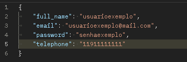

#### Formato de corpo de resposta esperado

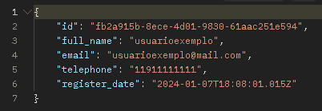

### POST - /login

- Rota para geração de token com os seguintes dados:
  - **Email**: Uma string e obrigatório, não pode ser vazia e deve ter o formato de email e deve ser único.
  - **Password**: Uma string e obrigatório, deve ter no mínimo 8 caracteres, sendo uma letra minúscula, uma maiúscula e um número.

#### Formato de corpo de requisição esperado

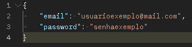

#### Formato de corpo de resposta esperado

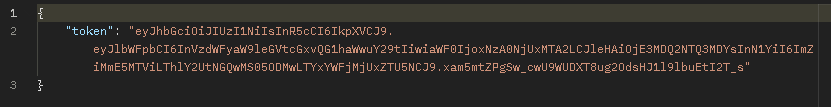

### GET - /clients

- Rota para recuperação de clientes já registrados

#### Formato de corpo de resposta esperado

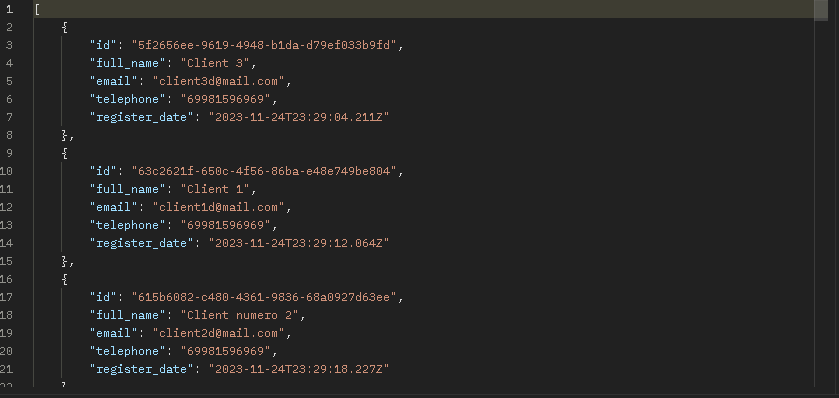

### GET - /clients/<client_id>

- Rota para recuperação de um cliente específico, que depende diretamente do token que é enviado, deve receber token e o id do cliente.

#### Formato de corpo de resposta esperado

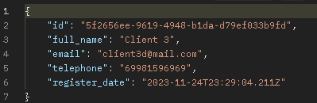

### PATCH - /clients/<client_id>

- Rota para atualizar as informações pessoais de um cliente específico, deve receber token e o id do cliente.
- Não é possível alterar o **id** e nem o **register_date**
- Usuários só podem atualizar suas próprias informações.

#### Formato de corpo de resposta esperado

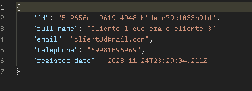

### DELETE - /clients/<client_id>

- Rota para deletar o usuário da aplicação, deve receber token e o id do cliente.
- Não possui corpo de resposta

### GET - /contacts

- Rota para recuperação de contatos associados ao cliente, identificado pela passagem do token

#### Formato de corpo de resposta esperado

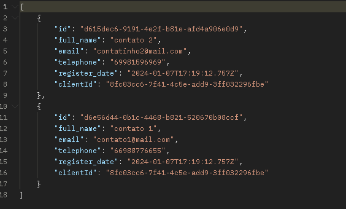

### POST - /contacts

- Rota para criação de contatos associados a um cliente, identificado pela passagem do token
  - **Nome Completo**: Uma string e obrigatória, mínimo de 1 caractere e máximo de 151 caracteres.
  - **Email**: Uma string e obrigatório, não pode ser vazia e deve ter o formato de email e deve ser único.
  - **Telefone**: Uma string e obrigatória, deve ter 11 caracteres.

#### Formato de corpo de requisição esperado

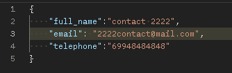

#### Formato de corpo de resposta esperado

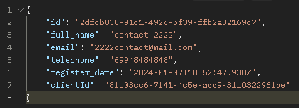

### PATCH - /contacts/<contact_id>

- Rota para atualizar as informações de um contato do cliente, deve receber token e o id do contato
- Não é possível alterar o **id**,o **register_date** e nem o **clientId**.
- Usuários só podem atualizar suas próprias informações.

#### Formato de corpo de resposta esperado

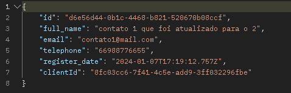

### DELETE - /contacts/<contact_id>

- Rota para deletar um contato da aplicação, deve receber token e o id do contato.
- Não possui corpo de resposta
